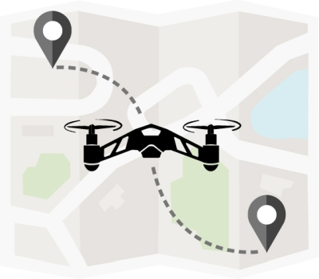

The **UC Center of Excellence on Unmanned Aircraft System Safety** has developed this portal of resources for all users of Unmanned Aircraft Systems within the University of California.

## UC Drone Web App

To submit UC flight requests and reports, use the [UC Drone Web App](https://ehs.ucop.edu/drones).

{fig-alt="Decorative Image of UC Drone Web App" width="40%" fig-align="center"}

::: {.callout-important title="Restrictions on foreign-made drones"}
- **Federally funded projects:** Drones from DJI, Autel, and other covered foreign manufacturers can no longer be purchased or flown on federally funded projects.
- **New FCC authorizations:** New foreign-made drone models can no longer receive FCC equipment authorization, with limited exceptions. Drones that are already authorized can still be owned and flown.

Review your fleet and projects now, and [contact us](mailto:uassafety@ucmerced.edu) if you have questions.
:::

## Connect with Us

To join the UC Drone listserv, [email us a listserv request](mailto:uassafety@ucmerced.edu?subject=UC%20Drone%20Listserv%20Request&body=Please%20sign%20me%20up%20for%20the%20UC%20Drone%20listserv).

Want to talk with us online? Use our [Booking Link](https://outlook.office365.com/owa/calendar/UCCenterofExcellenceonUASSafety@merced.onmicrosoft.com/bookings/). Pick a time that works for you, and the system will schedule a Microsoft Teams meeting.

## Quick Links

- **[New User Guide](https://ucdrones.github.io/New_User_Guide/)** - New to Drones? New to flying for Research? Start here for an overview of the UC policy and procedures.
- **[Unmanned Aircraft System (Drone) Policy](https://policy.ucop.edu/doc/3500671/Drone)** - The UC Presidential Policy on the use of Unmanned Aircraft Systems within the University of California.
- **[Drone Map of California](https://ucdrones.github.io/map)** -  Map of UC properties, County/City regulations, and public lands.

**Last update: **

